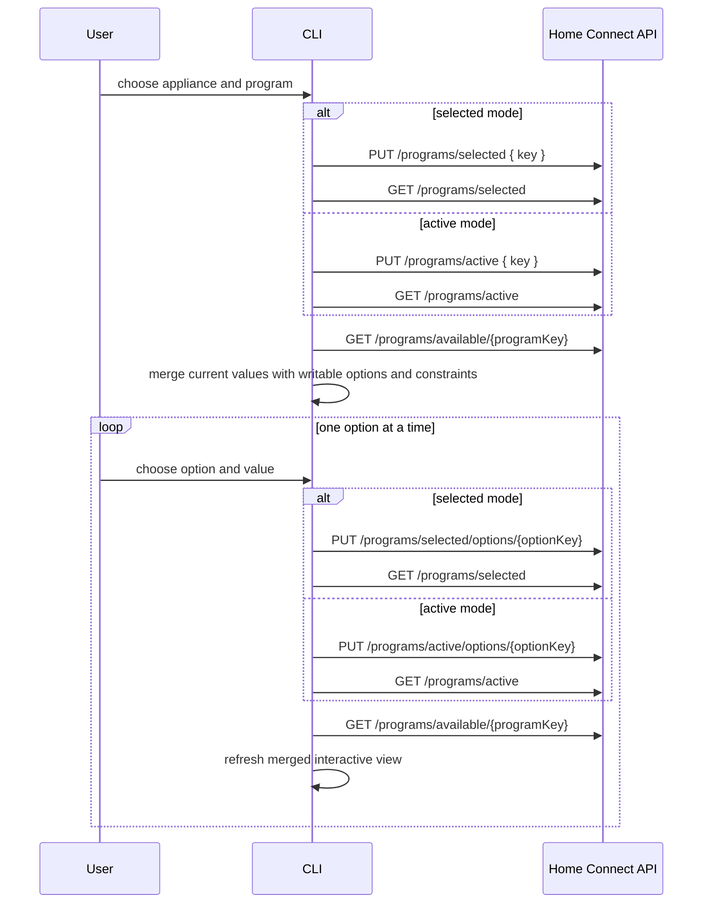

# Home Connect CLI

[](https://nodejs.org/)
[](https://www.typescriptlang.org/)
[](https://developer.home-connect.com/)

Unofficial _Command Line Interface (CLI)_ for [Home Connect](https://www.home-connect.com) home appliances like connected dishwashers, coffee makers or fridge freezer.

## 📚 Table of contents

- [Start here](#-start-here)
- [Installation](#-installation)
- [Simulator](#-simulator)
- [Profiles and defaults](#-profiles-and-defaults)
- [Command reference](#-command-reference)
- [Notes](#-notes)

Command groups:

<details>
<summary>Auth commands</summary>

- [`hc auth login`](#hc-auth-login)
- [`hc auth device-login`](#hc-auth-device-login)
- [`hc auth status`](#hc-auth-status)
- [`hc auth logout`](#hc-auth-logout)
- [`hc profile get`](#hc-profile-get)
- [`hc profile set`](#hc-profile-set)

</details>

<details>
<summary>Appliance and state commands</summary>

- [`hc appliance get`](#hc-appliance-get)
- [`hc status get`](#hc-status-get)
- [`hc setting get`](#hc-setting-get)
- [`hc setting set`](#hc-setting-set)

</details>

<details>
<summary>Program and event commands</summary>

- [`hc program get`](#hc-program-get)
- [`hc program selected get`](#hc-program-selected-get)
- [`hc program selected set`](#hc-program-selected-set)
- [`hc program active get`](#hc-program-active-get)
- [`hc program active set`](#hc-program-active-set)
- [`hc program start`](#hc-program-start)
- [`hc program stop`](#hc-program-stop)
- [`hc event tail`](#hc-event-tail)

</details>

<details>
<summary>Completion</summary>

- [`hc completion generate`](#hc-completion-generate)

</details>

## 🚀 Start here

Install, authenticate, and list appliances:

```bash
npm install -g github:mroeckl/homeconnect-cli
hc auth device-login --client-id <client-id>
hc appliance get
```

For the simulator:

```bash
hc --profile simulator --env simulator auth login \
  --client-id <client-id> \
  --redirect-uri https://apiclient.home-connect.com/o2c.html

hc --profile simulator appliance get
```

---

## 📦 Installation

### ✅ Prerequisites

- Node.js 20 or newer, including `npm`
- Your Home Connect account from the Home Connect app
- A _client-id_ from the [Home Connect Developer Portal](https://developer.home-connect.com)

### ⚡ Quick start with `npx`

```bash
npx github:mroeckl/homeconnect-cli auth device-login --client-id <client-id>
```

### 🌍 Global install

```bash
npm install -g github:mroeckl/homeconnect-cli
```

### 🛠️ Local development install

```bash
npm install
npm run build
npm link
```

### 🔑 Create application

1. Open https://developer.home-connect.com and register/login
2. Create a new application
   > Application ID: e.g. hc_cli \
   > OAuth Flow: Device Flow \
   > Home Connect User Account for Testing: your account from the HC App
3. Copy the client ID

### 🔐 Login

```bash
hc auth device-login --client-id <client-id>
```

and test if you can see your appliances:

```bash
hc appliance get
```

### 🧪 Simulator

- use a separate profile, for example `simulator`
- use `auth login`, not `auth device-login`
- use the simulator client that already exists in your account on <https://developer.home-connect.com>
- use its simulator `client_id`
- use the configured redirect URI `https://apiclient.home-connect.com/o2c.html`

```bash
hc --profile simulator --env simulator auth login \
  --client-id <client-id> \
  --redirect-uri https://apiclient.home-connect.com/o2c.html

hc --profile simulator appliance get
```

This keeps simulator credentials and state separate from production.

### 💡 Common examples

```bash
hc auth device-login --profile production --client-id <client-id>
hc auth status
hc profile get
hc profile set --env simulator
hc profile set --language de-DE
hc profile set --output json
hc appliance get
hc status get
hc status get --appliance SIEMENS-HCS01DW123456
hc setting get
hc program get
hc setting set \
  --appliance SIEMENS-HCS01DW123456 \
  --setting BSH.Common.Setting.PowerState=BSH.Common.EnumType.PowerState.On
hc program selected set \
  --appliance Dishy \
  --program Dishcare.Dishwasher.Program.Eco50 \
  --option Dishcare.Dishwasher.Option.ExtraDry=true
hc program selected get --appliance SIEMENS-HCS01DW123456
hc program start --appliance SIEMENS-HCS01DW123456
hc --appliance SIEMENS-HCS01DW123456 program active get
```

---

## ⚙️ Profiles and defaults

- `--profile <profile>`: profile name stored in the CLI state file. Default: `production`.
- `--appliance <applianceId>`: optional appliance selector that can be placed before or after the command path, for example `hc --appliance Dishy program selected get`. Appliance names and IDs are supported.
- `--env <environment>`: Home Connect environment. Supported values: `production`, `simulator`. If omitted, the CLI uses the stored profile environment when set, otherwise `production`.
- `--language <language>`: temporary `Accept-Language` override, for example `de-DE`.
- `--output <format>`: temporary output override. Supported values: `human`, `json`, `jsonl`. If omitted, the CLI uses the stored profile output when set, otherwise `human`.
- `--debug`: include extra API error details such as a redacted `curl` reproduction command.
- `--interactive`: enable guided prompts where supported.

Profile bootstrap behavior:

- If `--env`, `--language`, or `--output` is used explicitly and the selected profile does not have that value stored yet, the CLI persists that first value into the profile automatically.
- Once a value is already stored in the profile, later uses of `--env`, `--language`, or `--output` act as temporary overrides only.
- To change a stored value permanently, use `hc profile set`.

---

## 🧰 Command reference

### 🔐 Auth commands

#### `hc auth login`

Authorization Code Grant login.

Options:

- `--client-id <clientId>`: OAuth client ID.
- `--client-secret <clientSecret>`: OAuth client secret.
- `--redirect-uri <redirectUri>`: redirect URI used for the auth request and code exchange.

Behavior:

- prints the authorization URL
- accepts either the full redirect URL or the raw authorization code
- exchanges the code for tokens
- stores access token, refresh token, expiry, and scope in the selected profile

API:

- `GET /security/oauth/authorize`
- `POST /security/oauth/token`

Example:

```bash
hc auth login --profile production --client-id <client-id>
```

#### `hc auth device-login`

Device Flow login.

Options:

- `--client-id <clientId>`: OAuth client ID.
- `--client-secret <clientSecret>`: OAuth client secret if required by the app setup.

Behavior:

- requests a device code
- prints the verification URL and user code
- polls until authorization succeeds or times out
- stores access token, refresh token, expiry, and scope in the selected profile

API:

- `POST /security/oauth/device_authorization`
- `POST /security/oauth/token`

Example:

```bash
hc auth device-login --profile production --client-id <client-id>
```

#### `hc auth status`

Shows the effective authentication state for the selected profile.

Behavior:

- shows configured scope
- shows granted session scope
- shows whether the profile is authenticated
- shows token expiry if available
- shows rate-limit cooldown if active

Example:

```bash
hc auth status --output json
```

#### `hc auth logout`

Removes the stored session for the selected profile.

Example:

```bash
hc auth logout --profile production
```

#### `hc profile get`

Shows the stored configuration of the selected profile.

Example:

```bash
hc profile get
```

#### `hc profile set`

Updates selected profile defaults.

Options:

- `--env <environment>`: persisted profile environment. Supported values: `production`, `simulator`.
- `--language <language>`: persisted language used as `Accept-Language`, for example `de-DE`.
- `--output <format>`: persisted output. Supported values: `human`, `json`, `jsonl`.

Example:

```bash
hc profile set --env simulator
hc profile set --language de-DE
hc profile set --output json
```

### 🏠 Appliance commands

#### `hc appliance get`

Returns paired appliance information.

Behavior:

- without `--appliance`: lists all appliances currently available in the selected Home Connect account
- with `--appliance`: shows one appliance
- refreshes `/api/homeappliances`
- updates the local shadow state for all returned appliances

API:

- `GET /api/homeappliances`

Options:

- `--appliance <applianceId>`: optional Home Connect appliance ID.

Examples:

```bash
hc appliance get
```

```bash
hc appliance get --appliance SIEMENS-HCS01DW123456
```

### 📊 State commands

#### `hc status get`

Lists current status items.

Options:

- `--appliance <applianceId>`: optional appliance ID.

Behavior:

- without `--appliance`: refreshes appliance inventory and lists status for all connected appliances
- with `--appliance`: refreshes appliance inventory and lists status for this appliance

API:

- `GET /api/homeappliances/{haId}/status`

Example:

```bash
hc status get
```

```bash
hc status get --appliance SIEMENS-HCS01DW123456
```

#### `hc setting get`

Lists current settings.

Options:

- `--appliance <applianceId>`: optional appliance ID.
- `--setting <settingKey>`: optional setting key. Requires `--appliance`.

Behavior:

- without `--appliance`: refreshes appliance inventory and lists settings for all connected appliances
- with `--appliance`: refreshes appliance inventory and lists settings for this appliance
- with `--appliance` and `--setting`: refreshes appliance inventory and fetches one setting with its current constraints

API:

- `GET /api/homeappliances/{haId}/settings`
- `GET /api/homeappliances/{haId}/settings/{settingKey}`

Examples:

```bash
hc setting get
```

```bash
hc setting get --appliance SIEMENS-HCS01DW123456
```

```bash
hc setting get \
  --appliance SIEMENS-HCS01DW123456 \
  --setting BSH.Common.Setting.PowerState
```

#### `hc setting set`

Updates one or more appliance settings.

Options:

- `--appliance <applianceId>`: required appliance ID.
- `--setting <key=value>`: repeatable assignment flag.

Behavior:

- fetches current settings first
- validates that the setting key is currently available
- sends only validated settings
- shell completion can suggest exact allowed setting values after `--setting Key=`

API:

- `GET /api/homeappliances/{haId}/settings`
- `PUT /api/homeappliances/{haId}/settings/{settingKey}` for each `--setting`

Examples:

```bash
hc setting set \
  --appliance SIEMENS-HCS01DW123456 \
  --setting BSH.Common.Setting.PowerState=BSH.Common.EnumType.PowerState.On
```

```bash
hc setting set --interactive --appliance SIEMENS-HCS01DW123456
```

### ▶️ Program commands

#### `hc program get`

Returns available program information.

Options:

- `--appliance <applianceId>`: optional appliance ID.
- `--program <programKey>`: optional program key.

Behavior:

- without `--appliance`: lists programs for all connected appliances
- with `--appliance`: lists programs for one appliance
- with `--appliance` and `--program`: shows one currently available program with its current options and constraints
- reads `/programs/available`
- caches the currently runnable programs for later validation and completion

API:

- `GET /api/homeappliances/{haId}/programs/available`
- `GET /api/homeappliances/{haId}/programs/available/{programKey}`

Examples:

```bash
hc program get
```

```bash
hc program get --appliance SIEMENS-HCS01DW123456
```

```bash
hc program get \
  --appliance SIEMENS-HCS01DW123456 \
  --program Dishcare.Dishwasher.Program.Eco50
```

#### `hc program selected get`

Shows the currently selected program.

Options:

- `--appliance <applianceId>`: required appliance ID.

API:

- `GET /api/homeappliances/{haId}/programs/selected`

Example:

```bash
hc program selected get --appliance SIEMENS-HCS01DW123456
```

#### `hc program selected set`

Changes the selected program and its options without starting it.

Options:

- `--appliance <applianceId>`: required unless `--interactive` is used.
- `--program <programKey>`: optional.
- `--option <key=value>`: repeatable option assignment.

Behavior:

- with `--program`: changes the selected program and optionally applies options
- without `--program`: applies options to the currently selected program
- validates option keys and values against the current selected program detail
- stores the selected program in local shadow state

API:

- with `--program`:
  - `GET /api/homeappliances/{haId}/programs/available/{programKey}`
  - `PUT /api/homeappliances/{haId}/programs/selected`
- with `--option` only:
  - `GET /api/homeappliances/{haId}/programs/selected`
  - `PUT /api/homeappliances/{haId}/programs/selected/options/{optionKey}` for each `--option`
- result rendering:
  - `GET /api/homeappliances/{haId}/programs/selected`

Examples:

```bash
hc program selected set \
  --appliance SIEMENS-HCS01DW123456 \
  --program Dishcare.Dishwasher.Program.Eco50 \
  --option Dishcare.Dishwasher.Option.ExtraDry=true
```

```bash
hc program selected set \
  --appliance SIEMENS-HCS01DW123456 \
  --option Dishcare.Dishwasher.Option.ExtraDry=true
```

```bash
hc program selected set --interactive
```

#### `hc program active get`

Shows the currently active program.

Options:

- `--appliance <applianceId>`: required appliance ID.

API:

- `GET /api/homeappliances/{haId}/programs/active`

Example:

```bash
hc program active get --appliance SIEMENS-HCS01DW123456
```

#### `hc program active set`

Activates a program through `/programs/active`, or updates active-program options through `/programs/active/options/{optionKey}`.

Options:

- `--appliance <applianceId>`: required appliance ID.
- `--program <programKey>`: active program key when changing the active program.
- `--option <key=value>`: repeatable option assignment.

API:

- with `--program`:
  - `GET /api/homeappliances/{haId}/programs/available/{programKey}`
  - `PUT /api/homeappliances/{haId}/programs/active`
- with `--option` only:
  - `GET /api/homeappliances/{haId}/programs/active`
  - `GET /api/homeappliances/{haId}/programs/available/{programKey}`
  - `PUT /api/homeappliances/{haId}/programs/active/options/{optionKey}` for each `--option`
- result rendering:
  - `GET /api/homeappliances/{haId}/programs/active`

Example:

```bash
hc program active set \
  --appliance SIEMENS-HCS01DW123456 \
  --program Cooking.Oven.Program.HeatingMode.HotAir \
  --option Cooking.Oven.Option.SetpointTemperature=180
```

```bash
hc program active set \
  --appliance SIEMENS-HCS01DW123456 \
  --option Cooking.Oven.Option.SetpointTemperature=180
```

#### Interactive program flow

In interactive mode, program configuration is server-backed and sequential for both selected and active programs.

- `hc program selected set --interactive`
- `hc program active set --interactive`

The CLI updates the selected or active program one option at a time through the per-option endpoints and refreshes the current writable option model after each change.



Notes:

- Current option values come from `/programs/selected` or `/programs/active`.
- Writable options and value ranges come from `/programs/available/{programKey}`.
- Interactive option changes use `/programs/selected/options/{optionKey}` or `/programs/active/options/{optionKey}`, not the full program body endpoints.
- `BSH.Common.Option.StartInRelative` and `BSH.Common.Option.FinishInRelative` are excluded from selected-program configuration, but remain available for active-program configuration.

#### `hc program start`

Starts a program.

Options:

- `--appliance <applianceId>`: required unless `--interactive` is used.
- `--program <programKey>`: optional.
- `--option <key=value>`: repeatable option assignment.

Behavior:

- if `--program` is provided: performs validated select+start
- if `--program` is omitted: starts the currently selected program
- validates connectivity, program availability, and option values before sending the request

API:

- with `--program`:
  - `GET /api/homeappliances/{haId}/programs/available/{programKey}`
  - `PUT /api/homeappliances/{haId}/programs/active`
- without `--program`:
  - `GET /api/homeappliances/{haId}/programs/selected`
  - `GET /api/homeappliances/{haId}/programs/available/{programKey}`
  - `PUT /api/homeappliances/{haId}/programs/active`

Examples:

```bash
hc program start \
  --appliance SIEMENS-HCS01DW123456 \
  --program Dishcare.Dishwasher.Program.Eco50 \
  --option Dishcare.Dishwasher.Option.ExtraDry=true
```

```bash
hc program start --appliance SIEMENS-HCS01DW123456
```

#### `hc program stop`

Stops the currently active program on the appliance.

Options:

- `--appliance <applianceId>`: required appliance ID.

API:

- `GET /api/homeappliances`
- `DELETE /api/homeappliances/{haId}/programs/active`

Example:

```bash
hc program stop --appliance SIEMENS-HCS01DW123456
```

### 📡 Event commands

#### `hc event tail`

Streams raw appliance events.

Options:

- `--appliance <applianceId>`: required appliance ID.

Behavior:

- opens the Home Connect event stream
- updates event freshness in the local cache while streaming
- works best with `--output jsonl`

API:

- `GET /api/homeappliances/{haId}/events`

Example:

```bash
hc event tail --appliance SIEMENS-HCS01DW123456 --output jsonl
```

### ✨ Completion

#### `hc completion generate`

Generates a shell completion script.

Options:

- `--shell <shell>`: shell type. Currently `bash` and `zsh` are supported. Default: `bash`.

Examples:

```bash
hc completion generate --shell bash
hc completion generate --shell zsh
```

Zsh usage:

```bash
mkdir -p ~/.zfunc
hc completion generate --shell zsh > ~/.zfunc/_hc
echo 'fpath=(~/.zfunc $fpath)' >> ~/.zshrc
echo 'autoload -Uz compinit && compinit' >> ~/.zshrc
source ~/.zshrc
```

Notes:

- `fpath=(~/.zfunc $fpath)` prepends your custom completion directory and keeps any existing `fpath` entries.
- If `compinit` is already configured in your `~/.zshrc`, only the `fpath` line and the generated `_hc` file are needed.
- Completion covers command groups, subcommands, command flags, and cached dynamic values such as appliances and available programs.
- Program, option, and setting keys support segment-aware matching, so inputs like `Espresso`, `ExtraDry`, or `PowerState` can complete full technical keys.

## 📝 Notes

- The state store lives under `$XDG_CONFIG_HOME/homeconnect-api-cli/state.json` or `~/.config/homeconnect-api-cli/state.json`.
- Dynamic shell completion is backed by cached state to avoid avoidable API traffic. Regenerate `_hc` after CLI changes.
- Most appliance, status, setting, and program commands refresh from the API before updating local state. Cached state is mainly used for profile/session data, appliance selector resolution, and shell completion.
